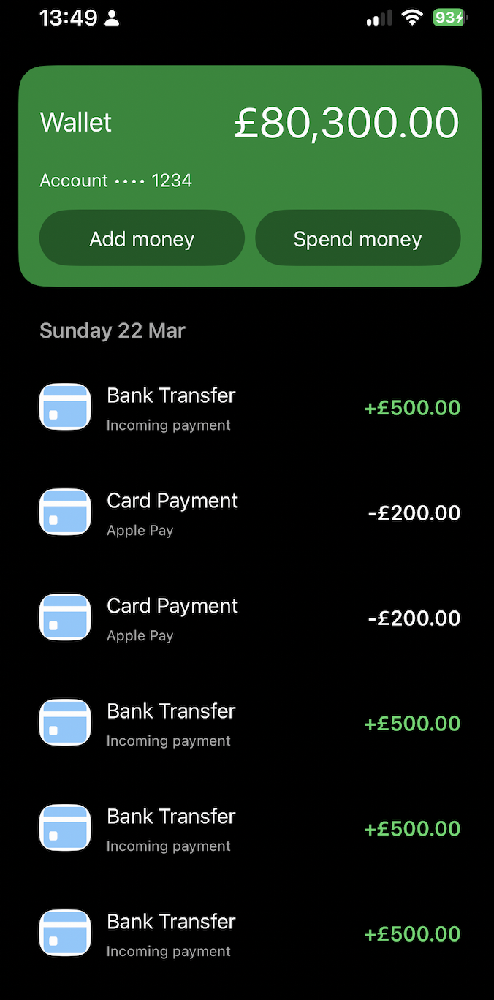

# SecureWallet-iOS


SecureWallet-iOS is a fintech-grade iOS project demonstrating a secure wallet and payout pipeline built with Clean Architecture, MVVM, UIKit and strict Test-Driven Development (TDD).


---

## 💥 What This Project Demonstrates

- Designing financial systems where **correctness is prioritised **
- Implementing **encryption-at-rest with proper key management**
- Building **deterministic, replay-based state systems**
- Applying **modern UIKit architecture (diffable + compositional layout)**
- Writing **testable, auditable, production-grade iOS code**


## 🏗 Architecture Overview

The project is divided into three primary modules:

```text
SecureWalletApp     → iOS Application 
SecureWalletDomain  → Pure business logic (no frameworks)
SecureWalletData    → Infrastructure & implementations
```

## 🔄 Wallet Execution Flow (State → Persistence → UI)

```text
User Action (Add / Spend)
   ↓
ViewController
   ↓
ViewModel (state orchestration)
   ↓
WalletService (use case boundary)
   ↓
Wallet (domain logic, validation)
   ↓
WalletStore (persistence boundary)
   ↓
Core Data (encrypted payload)
   ↓
Wallet reconstructed via replay
   ↓
@Published state updated
   ↓
Diffable snapshot applied
   ↓
UI reflects new state
```


---


## 🧠 Domain Layer (Single Source of Truth)

The `SecureWalletDomain` module contains:
The domain module contains all financial rules and invariants.

## Core Components

### CoinAmount
- Immutable value object storing milliCoins  
- Prevents negative values  
- Safe arithmetic operations  

### LedgerEntry
- Immutable entity  
- Credit / Debit direction  
- Timestamped  

### Wallet (Aggregate Root)
- Owns append-only ledger  
- Balance is derived, never stored  
- Enforces all financial invariants  

### WalletRecord
- Deterministic persistence representation  

### WalletStore
- Protocol boundary for persistence  

## Financial Invariants Enforced

- Balance is never stored directly  
- Balance can never be negative  
- Debit greater than balance throws  
- Debit equal to balance succeeds  
- Failed debit does not mutate state  
- Ledger entries are append-only  
- Duplicate entry IDs are ignored (idempotency)  
- Wallet state is reconstructed via deterministic replay  

The domain is fully unit tested and framework-agnostic.

---


---

## 📱 iOS Engineering Highlights (UIKit)

This project intentionally uses **UIKit** to demonstrate production-level iOS engineering skills.

### 🧩 Modern Collection View Architecture

- `UICollectionViewCompositionalLayout`
  - Section-based layout (balance + transaction feed)
  - Dynamic sizing using `.estimated`
  - Clean separation via `WalletLayoutFactory`

- `UICollectionViewDiffableDataSource`
  - Snapshot-driven UI updates
  - Eliminates manual index management
  - Ensures UI consistency with state

- Supplementary Views (Headers)
  - Date-grouped transaction sections
  - Configured via `supplementaryViewProvider`

---

### 🔄 State-Driven UI (Combine)

- ViewModel exposes state via:
  - `@Published balance`
  - `@Published transactions`

- UI binding:
```swift
Publishers.CombineLatest(viewModel.$balance, viewModel.$transactions)
```

---

## 📱 App Layer (MVVM)

The App layer is responsible for rendering state and handling user interaction.

- ViewModels:
  - Expose state via `@Published`
  - Contain no business logic
  - Orchestrate use cases via services

- ViewControllers:
  - Bind to ViewModel using Combine
  - Apply diffable snapshots
  - Handle UI composition only

> UI is fully state-driven. No business rules exist outside the domain.


---

---

## 💾 Persistence Layer (Core Data + Encrypted Ledger)

The project uses **Core Data as a secure persistence engine**, storing wallet state as an **encrypted payload** rather than plain relational data.

### 🧠 Design Principle

> Persistence stores encrypted history. Domain reconstructs truth.

- Wallet is **not stored directly**
- Full state is serialized into a `WalletRecord`
- Stored as a **single encrypted blob**
- Domain rebuilds wallet via deterministic replay

---

### 🧱 Storage Model

Core Data entity:

- `WalletEntity`
  - `id: UUID`
  - `encryptedPayload: Data`

---

### 🔐 Save Flow (Secure & Atomic)

1. Convert `Wallet → WalletRecord`
2. Encode using `JSONEncoder`
3. Encrypt using AES-GCM
4. Store encrypted payload in Core Data

```text
Wallet (Domain)
   ↓
WalletRecord
   ↓
JSON Encode
   ↓
AES-GCM Encrypt 🔐
   ↓
Core Data (encryptedPayload)
```


---

## 🔐 Security & Cryptography

The project implements encryption-at-rest using Apple’s CryptoKit.

### Key Characteristics

- Wallet data is never stored in plaintext
- Encryption is enforced at the persistence boundary
- AES-256-GCM is used for authenticated encryption
- Keys are generated and stored securely using Keychain
- Decryption failures are treated as data corruption

### Flow

```text
Wallet → JSON → AES-GCM Encrypt → Core Data
Core Data → AES-GCM Decrypt → WalletRecord → Domain

```

---


---

## 🧪 Testing Strategy (TDD)

- Tests are written before implementation
- Domain logic is 100% unit tested
- Infrastructure is tested with mocks
- No Apple system APIs are used directly in tests

Test targets:
- SecureWalletDomainTests
- SecureWalletDataTests
- SecureWalletTests

---


## 📸 Wallet UI (UIKit, Compositional Layout, Diffable Data Source)

<p align="center">
  
</p>


---

SecureWallet-iOS focuses on engineering rigor rather than feature breadth.  
It is designed to demonstrate how financial systems should be built on iOS: deterministic, testable, and auditable.


